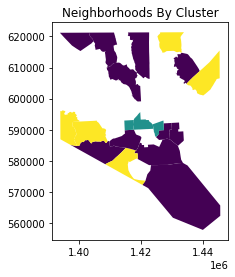
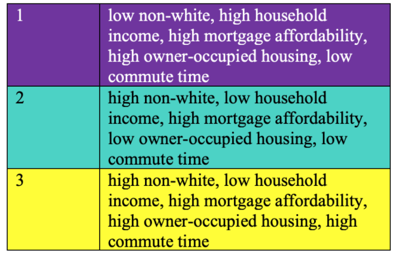

# Housing Development: Assessing Opportunity Zones in Baltimore, MD 
## Background Information 
In West Baltimore’s historic Harlem Park neighborhood, where 96.9% of the total population are Black or African American, [one out of every three houses are vacant and abandoned](https://health.baltimorecity.gov/sites/default/files/47%20Sandtown.pdf). Harlem's Park's urban blight results from Baltimore's [long history of "red-lining,"](https://www.npr.org/2018/08/07/632497683/in-baltimore-the-gap-between-white-and-black-homeownership-persists) where mortgage loan companies excluded predominantly black neighborhoods from mortgage relief in the wake of the Great Depression. This practice led to de facto racial and economic segregation that persists in the form of Baltimore's "Black Butterfly." Neighborhoods in this area feature high rates of home abandonment and poor infrastructure, which contribute to [many social inequities](https://journalistsresource.org/studies/government/municipal/abandoned-buildings-revitalization/) like rampant crime, drug abuse, and limited economic and social mobility. To alleviate this issue, the federal government passed the 2017 Tax Cuts and Jobs Act to heavily reduce income taxes and bolster capital flow into the poorest areas of the country. The legislation created [the Opportunity Zones initiative](https://taxfoundation.org/final-tax-cuts-and-jobs-act-details-analysis/#:~:text=The%20Tax%20Cuts%20and%20Jobs%20Act%20would%20reform%20the%20individual,and%20simplifying%20the%20tax%20code). Areas within Baltimore that are in need of commercial investment are designated as an “Opportunity Zone,” and investors are guaranteed tax benefits when they funnel their cash into community funds that finance community housing projects and local businesses.

## Problem Statement
How successful are Opportunity Zones in Baltimore at stimulating economic growth without contributing to gentrification, and what additional risk factors can we focus on to improve the effectiveness of such government initiatives? 

## Data Questions
Which metrics of housing development are statistically significant in regards to percent-nonwhite (an indicator of neighborhoods within the Black Butterfly)? Does private investment decrease mortgage affordability in Baltimore? What impact have Opportunity Zones had on metrics of housing development? 

## Data Sources
[Raw dataset](Final_Raw_Data.xlsx) were pulled from two open sources: Opportunity Insights’ [Opportunity Atlas](https://www.opportunityatlas.org/) and Baltimore Neighborhood Indicators Alliance’s [Vital Signs Open Data Portal](https://data-bniajfi.opendata.arcgis.com/), both of which quantitatively measure indicators of neighborhoods’ standard of living and overall well-being. The following variables were included in the multiple regression model, the first step of data analysis.

1. Percent non-White 
1. Average household income 
1. Percent of vacant and abandoned residential properties 
1. Rent affordability index - percentage of households that pay more than 30% of total household income on rent and related expenses 
1. Mortgage affordability index - percentage of households that pay more than 30% of total household income on mortgage and housing-related expenses 
1. Percent of vacant city-owned properties 
1. Median price of homes sold 
1. Percent of owner-occupied housing units 
1. Rate of housing vouchers per 1,000 rental units - percentage of tenants in private rental market that are on housing voucher holders 
1. Total number of commercial properties 
1. Population growth/decline 
1. Number of banks per 1,000 residents
1. Total dollar amount invested in small business (per 50 businesses)
1. Percent of employed population with travel time to work of 0-14 minutes
1. Unemployment rate

## Data Answer 
Of the 15 datasets, with “Percent non-White” as the predicted variable in the multiple regression model, 4 variables were statistically significant, designated by a p-value less than 0.05: household income, mortgage affordability, percent of owner-occupied housing units, and percent of employed population with travel time to work of 0-14 minutes. Statistical significance of these variables indicate that they are reliable determinants of neighborhood standard of living, and they should be variables of interest as we move forward with data analysis.

 

This map of neighborhoods organized by risk factors provides a visual representation of the areas within the city that are in dire need of resources for economic growth. Neighborhoods in cluster 3 are at the highest risk of poor infrastructure - low-income residents struggle with secure housing and high commute times attributed to the lack of economic opportunity in their vicinity. Cluster 3 neighborhoods, as shown in the map, is located in the “Black Butterfly,” which encompasses the disadvantaged areas of West and East Baltimore. 

While many of the data analysis’ variables are not statistically significant when compared to race, the metric used to gauge neighborhoods in the black butterfly, many of the variables are statistically significant and correlated when compared directly to one another. Mortgage Affordability and Average Small Business Investment share a correlation of -0.27, meaning that mortgage affordability decreases on average when small business investment increases. This correlation is statistically significant, having a p-value of 0.007. The relationship between mortgage affordability and small business investment in Baltimore is modeled below:

The negative correlation between small business investment and mortgage affordability highlights how gentrification could present an issue for the Opportunity Zones’ development track. Notably, mortgage affordability has a correlation of 0.6 with percent non-white, meaning that non-white neighborhoods in their current state have more affordable mortgages. This finding supports long-held beliefs that Baltimore’s redlining practices segregated largely black populations into areas that, consequently, experienced low real estate values. Mortgage affordability is interestingly more prevalent in lower income neighborhoods. Again, this fact highlights that low income, black populations are vulnerable to gentrification’s sudden price rises.

Furthermore, fast commute times are negatively correlated at -0.3 with percent non-white, meaning that predominantly non-white neighborhoods experience longer commute times. Given the -0.5 correlation between percent non-white and household income in Baltimore, this finding aligns with previous analysis on the link between long commute times and lower household income. 

The multiple regression model and cluster analysis confirmed the statistical significance and validity of the datasets relevant to housing and community development. To evaluate the effectiveness of Opportunity Zones, we can look at data trends of each variable before and after the implementation of the program in 2017 to determine whether or not the increase in private investment in these Zones are fueling economic growth. 

Mortgage affordability decreased by roughly 0.5% after the implementation of opportunity zones. Because this decrease follows a trend of decreasing affordability over time, we cannot derive any conclusions as to whether or not Opportunity Zones themselves are responsible for the trend. As mentioned, mortgage affordability is negatively correlated to small business investment. Declining mortgage affordability is certainly a risk created by opportunity zones, but we cannot conclude if opportunity zones’ investment packages have made a significant impact on mortgage as of yet. 

The steady upward trendline for average household income is a promising indicator of growing capital flow and business opportunities within Opportunity Zones. 

The percentage of workers with low commute times has also decreased in Baltimore since 2018. The consistent decrease in the percentage of low commute times prior to 2017 indicates that the Opportunity Zones are not likely responsible for a rise in commute length. However, they have not stabilized or reversed the trend of lengthening commute times. 

In recent years, the percentage of owner-occupied houses in Baltimore has been decreasing. After the implementation of Opportunity Zones, the percentage has plateaued. We therefore cannot derive any conclusions from this finding, as there is no clear indication that Opportunity Zones have stabilized the number of homeowners living in their own properties. 

Data before and after the Opportunity Zones initiative is inconclusive on whether private investment in these areas contributed to the improvement in housing and neighborhood vitality. Although we observe a steady increase in average household income, there are no consistent trendlines for the remaining variables. A possible explanation for this, and an important point to note, is that efforts in community development programs need to be sustained over long periods of time for us to observe a substantial change in data trends. Baltimore’s poorest neighborhoods struggle with crime, drug use, inadequate healthcare, etc., and all of these issues are connected to the city’s failing infrastructure. 

In addition, the variables of interest in our data analysis not capturing the successes or shortcomings of Opportunity Zones is most likely due to the limited open datasets available for analysis. Datasets examining rates of commercial lending, mortgage loans, and private investments in each neighborhood would have given more insight into economic activity and cash inflows.  

Of note, none of our identified target areas in Cluster 3 overlapped with any Opportunity Zones, despite their low standards of living. 

## Final Recommendations 

The following recommendations are intended for the Baltimore Department of Housing and Community Development. Our recommendations are two-fold: suggestions on existing city-wide initiatives, and new neighborhood-level policies. For city-wide initiatives, the Department of Housing and Community Development should fund independent community land trusts, which provide relief for Baltimore’s lowest income residents who do not have enough income for a long-term saving plan. In combination with community land trusts, funding housing refurbishment and transfer of vacant properties to land trusts will provide a select number of low-income housing modules to those in dire need, while also increasing the property values of current homeowners and allowing for the accruement of intergenerational wealth. Lastly, the department should also increase its funding to housing vouchers for low-income renters and homeowners to offset their rising living costs. 

The implementation of neighborhood-specific programs, in combination with city-level initiatives mentioned in the previous section, will address the economic and environmental needs of low-income neighborhoods. To stimulate economic opportunity, policies to establish incubators for Black-owned businesses will provide the financial and educational resources needed to jumpstart businesses. Second, each neighborhood can partner with local non-profits to focus on housing renovation projects to revitalize vacant properties (this step can work in tandem with city-wide refurbishment programs). Lastly, youth education centers with low-cost services such as mental health services, career and leadership development, and STEM education. Prioritizing youth education equips younger populations with the skillsets necessary to succeed in the future.

Our proposal's costs can be broken down as follows: 

As the Department of Housing and Community Development should apply our recommendations on an initially small scale to troubleshoot their efficacy, we recommend that our stakeholder invests around $4.68 million into refurbishing the 65 abandoned homes already in its possession in target neighborhoods. 

A total investment of $20 million should be placed in housing programs identified in the housing initiatives section.

$24 million should be invested in total in the black business incubator, as we project the majority of selected neighborhoods’ economic growth and poverty reduction will result from revitalized local businesses. 

$1,000,000 in additional funding should be provided to support existing Youth Education programs. $650,000 should be designated for data collection and the appointment of government officials to neighborhood councils in target areas.

Funding for neighborhood level programs should come from two main sources. The first is the $6.5 billion in federal assistance that Baltimore receives each year. The second is private investment from an existing network of stakeholders and community funds within the Opportunity Zones program, in addition to a network of real estate investors willing to capitalize on Opportunity Zone tax benefits. 

For the housing initiatives, funding will be derived from a proposed $20 million contract for community land trust investment that Baltimore City is set to enact by 2023. We recommend re-allocating these funds towards our project, with $5 million going towards community land trust investments, and the remaining $15 million going towards housing vouchers for low-income residents. 

The current minimum budget of $50.1 million is designed only to accommodate a small-scale test of our development proposal in select neighborhoods. If the program can raise household incomes without significantly displacing local residents, then the Department of Housing and Community Development can scale it up to all of the city’s Opportunity Zones. Such an increase in scope would necessitate a proportional increase in the amount of funding required. Furthermore, elements of the program, such as funding for land trusts, housing vouchers, business incubators, and youth education centers will need to be funded on an ongoing basis beyond the initial trial period’s first year. Annually, the Department will also need to gather data on standard of living indicators and community feedback to ensure that the program is meeting its intended goals of raising incomes and stabilizing residents’ living costs.

A comprehensive overview of our recommendations [can be accessed here](https://github.com/John-Frye/housing_development_in_baltimore/blob/main/Recommendation_Frye_Tien.pdf).

